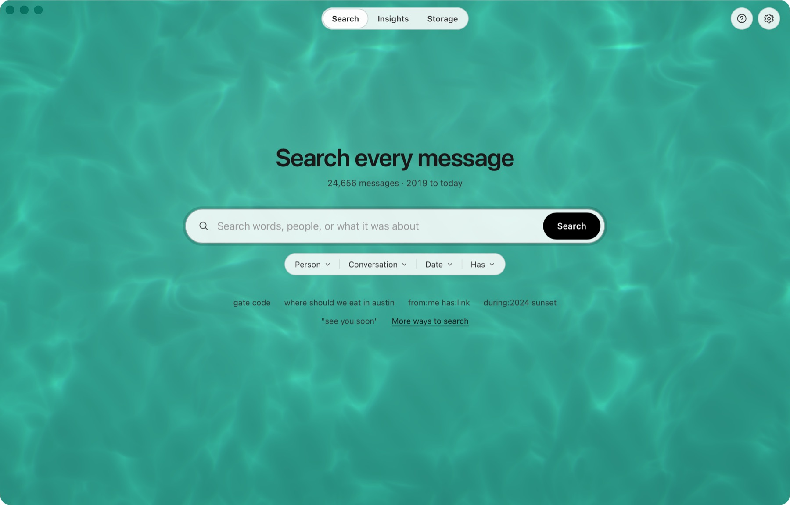
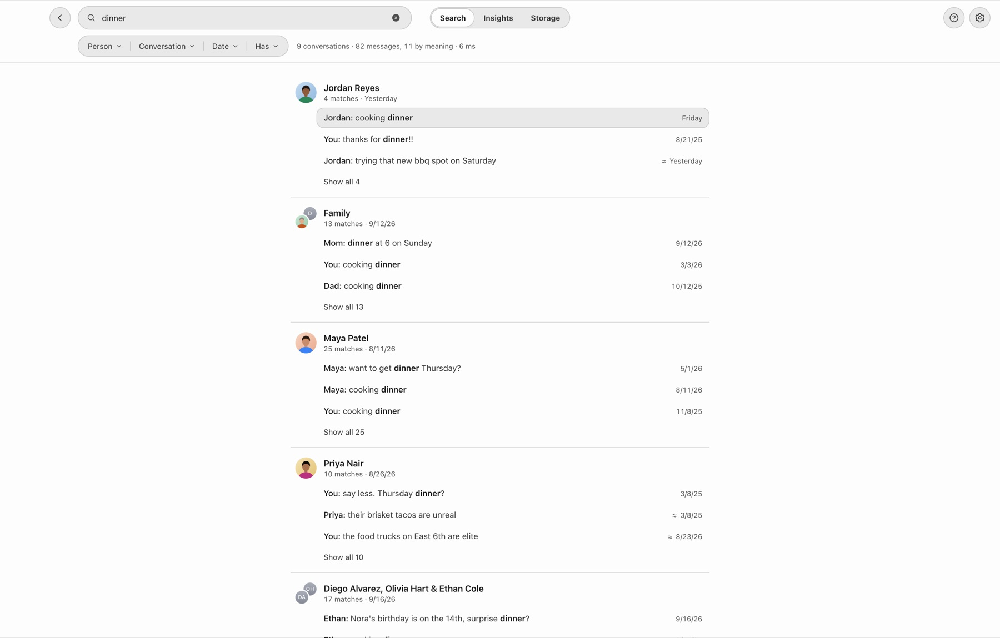
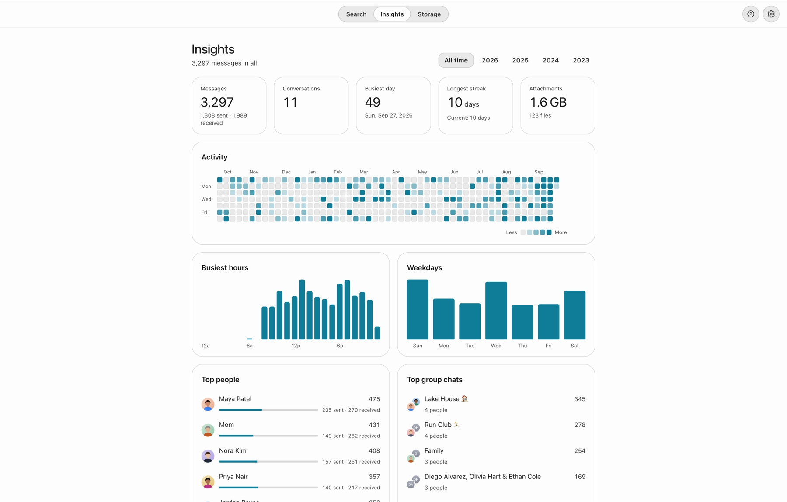
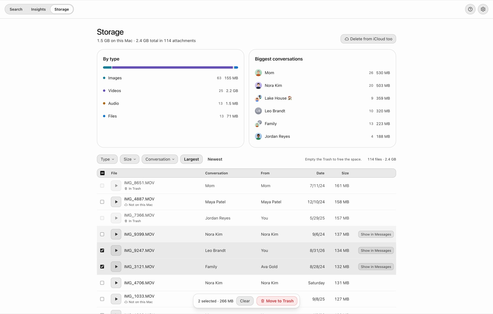
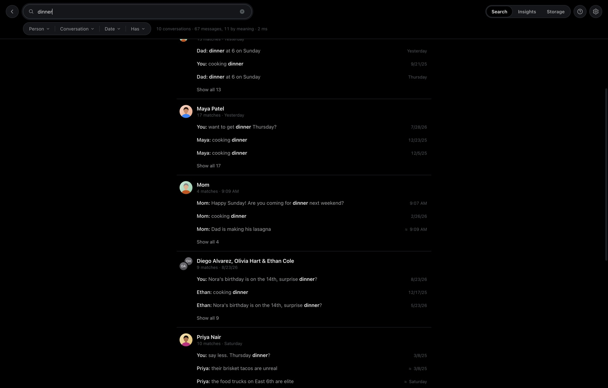

# Messages Search

Fast, private search for your Messages history on the Mac. Find any text by the words in it or by what it was about, see it in its conversation, browse your activity, and clean up the attachments taking up space. Everything runs on your Mac: nothing is uploaded, and your Messages database is only ever read, never changed.



| Search, grouped by conversation | Insights |
|---|---|
|  |  |
| **Storage** | **Dark mode** |
|  |  |

<sub>Screenshots use a generated history of fictional people.</sub>

**[Download for Mac](https://github.com/justingluska/messages-search/releases/latest)** · Apple Silicon · free and open source

> Not affiliated with or endorsed by Apple. "Messages" and "iMessage" are trademarks of Apple Inc.

## What it does

- **Search every message instantly.** Around 2 ms per search across 500,000 messages. Results are grouped by conversation, and a click opens the conversation right at the match.
- **Search by meaning.** "where should we eat in Austin" finds the restaurant recommendation even if nobody used those words. A small AI model runs locally (no cloud, no account).
- **Filters you can type or click.** `from:sarah`, `in:"Lake House"`, `with:mike`, `has:photo`, `has:link`, `during:2024`, `before:2023-06`, `"exact phrase"`, `-word`.
- **Insights.** A GitHub-style activity heatmap, busiest hours and days, streaks, your top people and group chats.
- **Storage.** Every attachment by size, type and conversation, with bulk **Move to Trash** (restorable) to free space on your Mac.
- **Photo viewer** with copy, save, open and show in Finder.
- **Names and photos from Contacts**, live updates as new messages arrive, light and dark mode, and a keyboard-first flow (`⌘K`, `↑`/`↓`, `Enter`, `Esc`, `⌘/` for help).

## Install

Requires an Apple Silicon Mac. Built and tested on macOS 26 Tahoe.

1. **[Download the latest release](https://github.com/justingluska/messages-search/releases/latest)** (`.dmg`, signed and notarized by Apple), open it and drag **Messages Search** to Applications. Or build it yourself (below).
2. Open **Messages Search** and click **Open System Settings**.
3. Turn on **Messages Search** under Privacy & Security → **Full Disk Access**, then choose **Quit & Reopen**. macOS keeps your Messages history behind this permission; the app can't read it otherwise.
4. Allow **Contacts** when asked, so results show names and photos instead of numbers.

The first launch reads your history (about 15 seconds for ~300,000 messages) and downloads the 67 MB search model once. Word search works right away; search by meaning builds in the background over a few minutes.

## Privacy

- **Local only.** The only network request the app ever makes is downloading the embedding model from Hugging Face on first launch (a pinned version, checked against a SHA-256 hash, no account or token sent). No telemetry, no analytics, no update pings.
- **Read-only.** `~/Library/Messages/chat.db` is opened read-only. The app never sends, edits or deletes messages.
- **Your index.** To be fast, the app keeps its own search index in `~/Library/Application Support/co.gluska.messagessearch/` (a folder only your user can read). It contains a copy of your message text, so treat it like the Messages database itself. Delete that folder to remove everything the app stored.
- **Move to Trash** only touches files inside `~/Library/Messages/Attachments`, and only moves them to the Trash. It frees space on this Mac only: the files stay in iCloud and on your other devices. Apple provides no way for other apps to delete from iCloud; use System Settings → General → Storage → Messages for that (the app links you there).

## How it works

```
Messages.app ──writes──▶ ~/Library/Messages/chat.db
                                   │ read-only
                                   ▼
ms-source   decode messages, reactions, edits, attachments; Contacts names/photos; watch for changes
ms-core     SQLite index: FTS5 keyword search + sqlite-vec vectors, hybrid ranking, insights, storage
ms-embed    bge-small-en-v1.5 (ONNX Runtime, on-device) → vectors for conversation snippets
ms-engine   background indexer and embedder; never blocks a search
apps/desktop  Tauri 2 + React UI (Rust backend, native macOS window)
```

- **Keyword search:** SQLite FTS5 with prefix matching and BM25 ranking with a mild recency boost. Natural-language questions fall back to matching any meaningful word.
- **Meaning search:** consecutive messages are grouped into short conversation windows, embedded locally with `bge-small-en-v1.5` (int8), and searched with `sqlite-vec`. Keyword and meaning results are merged with reciprocal rank fusion.
- **Speed:** every interaction reads the local index only. Nothing waits on the model or on indexing.

Details: [docs/ARCHITECTURE.md](docs/ARCHITECTURE.md).

## Build from source

Prerequisites: Rust (stable), Node 20+, Xcode command line tools.

```sh
cd apps/desktop
npm install
npm run tauri build -- --bundles app   # → target/release/bundle/macos/Messages Search.app
```

Full Disk Access is tied to the app's code signature. Sign your build (set `APPLE_SIGNING_IDENTITY`) so the permission survives rebuilds; unsigned builds have to be re-approved after every build.

### Development without your real messages

Everything can be developed against a generated database of fictional people:

```sh
python3 scripts/make-fixture.py                 # fixtures/chat.db (~26k fictional messages)
cargo test --workspace
cd apps/desktop && npm run dev:mock             # UI with mock data at http://localhost:1420
```

The `ms` CLI indexes, searches and benchmarks from the terminal (`cargo run -p ms-cli --release -- help`). Keep its `--index` outside the repo: an index built from a real `chat.db` contains your messages.

## Limitations

- Searches and browses; it doesn't send or delete messages (Apple offers no API for either).
- The default model is English. `multilingual-e5-small` is available in code but not yet exposed in the app.
- Nicknames like "Mom" aren't mapped to contacts yet.

## Author and support

Made by **Justin Gluska** ([justingluska.com](https://www.justingluska.com)). Questions, feedback or support: [@gluska on X](https://x.com/gluska). Bugs and feature requests: [GitHub issues](https://github.com/justingluska/messages-search/issues).

## License

[GPL-3.0-or-later](LICENSE). It builds on [imessage-database](https://github.com/ReagentX/imessage-exporter) (GPL-3.0) and other open-source projects listed in [THIRD-PARTY-NOTICES.md](THIRD-PARTY-NOTICES.md).
